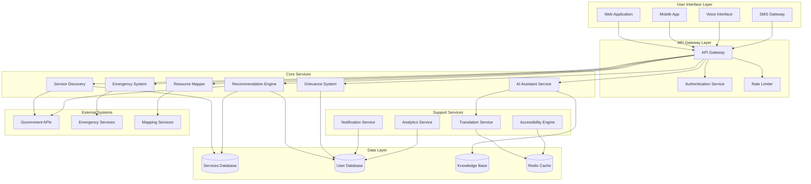

# Design Document: AI-Powered Community Access and Public Impact Platform

## Overview

The AI-powered Community Access and Public Impact Platform is a comprehensive system designed to bridge the gap between citizens and public services through intelligent, multilingual, and accessible technology. The platform leverages artificial intelligence to provide personalized service discovery, real-time assistance, and seamless navigation through complex government processes.

The system architecture follows a microservices approach with AI-powered components that can scale independently based on demand. The platform prioritizes inclusivity, supporting multiple languages, accessibility standards, and low-bandwidth environments to ensure no citizen is left behind in the digital transformation of public services.

## Architecture

The platform follows a distributed microservices architecture with the following key architectural principles:

### High-Level Architecture



### Architectural Patterns

1. **Microservices Architecture**: Each major component operates as an independent service
2. **Event-Driven Architecture**: Services communicate through events for loose coupling
3. **CQRS Pattern**: Separate read and write operations for better performance
4. **Circuit Breaker Pattern**: Fault tolerance for external service dependencies
5. **API Gateway Pattern**: Centralized entry point for all client requests

## Components and Interfaces

### AI Assistant Service

The AI Assistant Service is the core intelligence component that handles natural language processing, intent recognition, and response generation.

**Key Responsibilities:**
- Natural language understanding and processing
- Intent classification and entity extraction
- Conversation context management
- Response generation and personalization
- Escalation to human agents when needed

**Interfaces:**
```typescript
interface AIAssistantService {
  processQuery(query: string, userId: string, language: string): Promise<AIResponse>
  maintainContext(conversationId: string, context: ConversationContext): Promise<void>
  escalateToHuman(conversationId: string, reason: string): Promise<EscalationTicket>
  updateKnowledgeBase(serviceInfo: ServiceInformation): Promise<void>
}

interface AIResponse {
  response: string
  confidence: number
  suggestedActions: Action[]
  requiresEscalation: boolean
  conversationId: string
}
```

### Service Discovery Engine

The Service Discovery Engine helps citizens find relevant public services based on their needs and eligibility.

**Key Responsibilities:**
- Service catalog management
- Eligibility assessment
- Service ranking and filtering
- Step-by-step guidance generation
- Integration with government service portals

**Interfaces:**
```typescript
interface ServiceDiscoveryEngine {
  searchServices(query: string, userProfile: UserProfile): Promise<ServiceResult[]>
  getServiceDetails(serviceId: string): Promise<ServiceDetails>
  assessEligibility(serviceId: string, userProfile: UserProfile): Promise<EligibilityResult>
  generateGuidance(serviceId: string): Promise<ServiceGuidance>
}

interface ServiceResult {
  serviceId: string
  name: string
  description: string
  eligibilityScore: number
  requiredDocuments: string[]
  estimatedTime: string
}
```

### Recommendation Engine

The Recommendation Engine provides personalized service suggestions based on user profiles and behavior patterns.

**Key Responsibilities:**
- User profiling and preference learning
- Collaborative and content-based filtering
- Real-time recommendation generation
- A/B testing for recommendation optimization
- Privacy-preserving recommendation algorithms

**Interfaces:**
```typescript
interface RecommendationEngine {
  generateRecommendations(userId: string, context: RecommendationContext): Promise<Recommendation[]>
  updateUserProfile(userId: string, interactions: UserInteraction[]): Promise<void>
  trackRecommendationPerformance(recommendationId: string, outcome: string): Promise<void>
}

interface Recommendation {
  serviceId: string
  relevanceScore: number
  reasoning: string
  urgency: 'low' | 'medium' | 'high'
  expiryDate?: Date
}
```

### Translation Service

The Translation Service provides multilingual support across all platform interactions.

**Key Responsibilities:**
- Real-time text translation
- Language detection
- Cultural context preservation
- Translation quality assurance
- Offline translation capabilities

**Interfaces:**
```typescript
interface TranslationService {
  translate(text: string, fromLanguage: string, toLanguage: string): Promise<TranslationResult>
  detectLanguage(text: string): Promise<LanguageDetectionResult>
  validateTranslation(original: string, translated: string, language: string): Promise<ValidationResult>
}

interface TranslationResult {
  translatedText: string
  confidence: number
  alternativeTranslations: string[]
  preservedEntities: string[]
}
```

### Grievance Management System

The Grievance Management System handles citizen complaints and feedback with transparent tracking and resolution.

**Key Responsibilities:**
- Grievance intake and categorization
- Automatic routing to appropriate authorities
- Status tracking and updates
- Escalation management
- Performance analytics and reporting

**Interfaces:**
```typescript
interface GrievanceSystem {
  fileGrievance(grievance: GrievanceRequest): Promise<GrievanceTicket>
  updateGrievanceStatus(ticketId: string, status: GrievanceStatus, notes: string): Promise<void>
  getGrievanceStatus(ticketId: string): Promise<GrievanceDetails>
  escalateGrievance(ticketId: string, reason: string): Promise<void>
}

interface GrievanceRequest {
  citizenId: string
  category: string
  description: string
  priority: 'low' | 'medium' | 'high' | 'urgent'
  attachments?: File[]
}
```

### Resource Mapper

The Resource Mapper provides location-based discovery of community resources and services.

**Key Responsibilities:**
- Geospatial resource indexing
- Proximity-based search
- Real-time availability updates
- Route optimization
- Offline map capabilities

**Interfaces:**
```typescript
interface ResourceMapper {
  findNearbyResources(location: GeoLocation, radius: number, resourceType?: string): Promise<Resource[]>
  getResourceDetails(resourceId: string): Promise<ResourceDetails>
  updateResourceAvailability(resourceId: string, availability: AvailabilityStatus): Promise<void>
  getOptimalRoute(origin: GeoLocation, destinations: GeoLocation[]): Promise<RouteInformation>
}

interface Resource {
  resourceId: string
  name: string
  type: string
  location: GeoLocation
  distance: number
  availability: AvailabilityStatus
  contactInfo: ContactInformation
}
```

### Emergency Information System

The Emergency Information System provides critical information and assistance during crisis situations.

**Key Responsibilities:**
- Emergency alert distribution
- Crisis-specific information delivery
- Emergency contact management
- Offline emergency information access
- Integration with official emergency systems

**Interfaces:**
```typescript
interface EmergencySystem {
  getEmergencyInformation(location: GeoLocation, emergencyType: string): Promise<EmergencyInfo>
  subscribeToAlerts(userId: string, location: GeoLocation, alertTypes: string[]): Promise<void>
  reportEmergency(emergency: EmergencyReport): Promise<EmergencyResponse>
  getEvacuationRoutes(location: GeoLocation): Promise<EvacuationRoute[]>
}

interface EmergencyInfo {
  alertLevel: 'low' | 'medium' | 'high' | 'critical'
  instructions: string[]
  emergencyContacts: ContactInformation[]
  safetyGuidelines: string[]
  lastUpdated: Date
}
```

### Accessibility Engine

The Accessibility Engine ensures the platform is usable by citizens with diverse abilities and needs.

**Key Responsibilities:**
- Screen reader compatibility
- Voice navigation support
- Visual accessibility enhancements
- Cognitive accessibility features
- Assistive technology integration

**Interfaces:**
```typescript
interface AccessibilityEngine {
  generateAltText(image: ImageData): Promise<string>
  convertToAudio(text: string, language: string): Promise<AudioData>
  simplifyContent(content: string, readingLevel: number): Promise<string>
  enhanceVisualContrast(content: HTMLContent, contrastLevel: number): Promise<HTMLContent>
}
```

## Data Models

### User Profile Model

```typescript
interface UserProfile {
  userId: string
  demographics: {
    age?: number
    gender?: string
    location: GeoLocation
    languages: string[]
    educationLevel?: string
    occupation?: string
    incomeLevel?: string
  }
  preferences: {
    language: string
    accessibilityNeeds: AccessibilityRequirement[]
    communicationPreferences: CommunicationChannel[]
    privacySettings: PrivacySettings
  }
  serviceHistory: ServiceInteraction[]
  eligibilityCache: EligibilityRecord[]
  createdAt: Date
  lastUpdated: Date
}

interface AccessibilityRequirement {
  type: 'visual' | 'auditory' | 'motor' | 'cognitive'
  severity: 'mild' | 'moderate' | 'severe'
  assistiveTechnology?: string[]
}
```

### Service Information Model

```typescript
interface ServiceInformation {
  serviceId: string
  name: string
  description: string
  category: string
  provider: ServiceProvider
  eligibilityCriteria: EligibilityCriterion[]
  requiredDocuments: Document[]
  applicationProcess: ProcessStep[]
  processingTime: string
  fees: FeeStructure
  contactInformation: ContactInformation
  availableLanguages: string[]
  digitalChannels: DigitalChannel[]
  lastUpdated: Date
}

interface EligibilityCriterion {
  field: string
  operator: 'equals' | 'greater_than' | 'less_than' | 'in_range' | 'contains'
  value: any
  description: string
}

interface ProcessStep {
  stepNumber: number
  title: string
  description: string
  requiredActions: string[]
  estimatedTime: string
  dependencies: string[]
}
```

### Grievance Model

```typescript
interface GrievanceTicket {
  ticketId: string
  citizenId: string
  category: string
  subcategory?: string
  title: string
  description: string
  priority: 'low' | 'medium' | 'high' | 'urgent'
  status: GrievanceStatus
  assignedTo?: string
  createdAt: Date
  updatedAt: Date
  expectedResolution: Date
  actualResolution?: Date
  statusHistory: StatusUpdate[]
  attachments: Attachment[]
  citizenSatisfaction?: number
}

interface StatusUpdate {
  status: GrievanceStatus
  updatedBy: string
  notes: string
  timestamp: Date
}

enum GrievanceStatus {
  SUBMITTED = 'submitted',
  ACKNOWLEDGED = 'acknowledged',
  IN_PROGRESS = 'in_progress',
  PENDING_INFO = 'pending_info',
  RESOLVED = 'resolved',
  CLOSED = 'closed',
  ESCALATED = 'escalated'
}
```

### Knowledge Base Model

```typescript
interface KnowledgeEntry {
  entryId: string
  title: string
  content: string
  category: string
  tags: string[]
  language: string
  sourceType: 'official' | 'curated' | 'community'
  reliability: number
  lastVerified: Date
  relatedServices: string[]
  searchKeywords: string[]
  accessCount: number
  userRating: number
}

interface ConversationContext {
  conversationId: string
  userId: string
  sessionId: string
  currentIntent: string
  entities: EntityValue[]
  conversationHistory: Message[]
  userPreferences: UserPreferences
  contextVariables: Record<string, any>
  lastActivity: Date
}

interface Message {
  messageId: string
  sender: 'user' | 'assistant'
  content: string
  timestamp: Date
  language: string
  confidence?: number
  intent?: string
  entities?: EntityValue[]
}
```